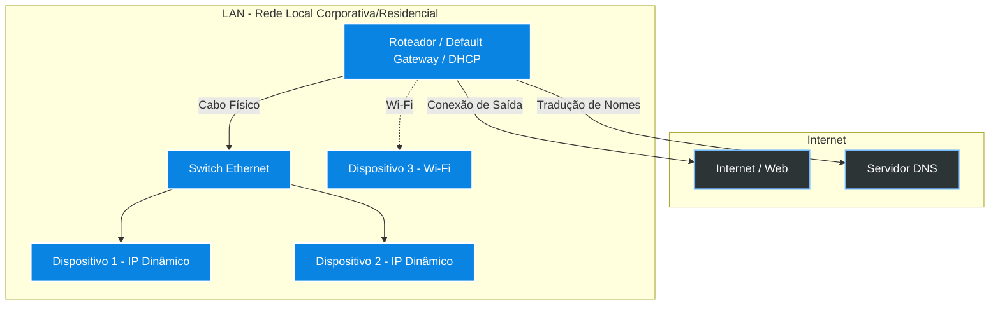

# 🌐 Network Security Cloud Foundations - 1SM 2026
**Fundamentos de Redes de Computadores e Internet**

---

## 📖 Sobre o Projeto
Este repositório armazena os materiais e conceitos abordados na disciplina **Network Security Cloud Foundations**, focando nos princípios arquitetônicos das **Redes de Computadores** e da **Internet**, englobando desde protocolos fundamentais até a organização lógica de IPs e portas de comunicação.

---

## 🚀 Tecnologias e Conceitos Abordados

  
  
  
  

### 📌 Resumo Lógico (Glossário Network)
Baseado no material da disciplina (`Material_01_Glossario_Network(1).ppt`), exploramos os seguintes fundamentos:
- **Redes de Computadores**: Conjunto de dispositivos conectados compartilhando dados e recursos.
- **Protocolo TCP/IP**: A base da comunicação na Internet (Transfer Control Protocol & Internet Protocol).
- **Endereçamento IP, MAC-ADDRESS & Mascaras (Sub-redes)**: 
  - *Classe A*: 255.0.0.0
  - *Classe B*: 255.255.0.0
  - *Classe C*: 255.255.255.0
- **Serviços Críticos**:
  - `DNS` (Domain Name System): Traduz o nome do host (domínio) para o IP do seu provedor.
  - `DHCP` (Dynamic Host Configuration Protocol): Atribui IPs e configurações de rede de forma automática.
  - `Default Gateway`: A porta de saída que interliga a residência/LAN à malha da Internet.
- **Ferramentas de Diagnóstico**: Uso de comandos clássicos como `ipconfig /all` e `ping`.

---

## 🗺️ Diagrama de Topologia de Rede (Mermaid)

Aqui está um diagrama de arquitetura de rede básica baseada nos ensinamentos das aulas:

---

## 🛠️ Comandos de Terminais Essenciais
Aqui temos uma lista dos comandos úteis abordados:

| Ícone | Comando Windows | Descrição da Funcionalidade |
|:---:|---|---|
| 🔍 | `ipconfig` / `ipconfig /all` | Permite a leitura das configurações de rede ativas (IP, Máscara, Gateway, MAC).|
| ⚡ | `ping <endereço>` | Dispara pacotes para testar a conectividade com outro IP ou host na rede. |
| 🛡️ | `telnet` / `ssh` | Protocolos utilizados para executar acesso remoto (e promover segurança, no caso do SSH). |

---

## 📎 Referências do Projeto
> *Nota: Os conceitos acima foram extraídos e adaptados a partir do material principal da disciplina depositado no repositório (`aulas/Material_01_Glossario_Network(1).ppt`).*

 

  <i>Desenvolvido ao longo do 1º Semestre de 2026 na FIAP.</i> 
  

